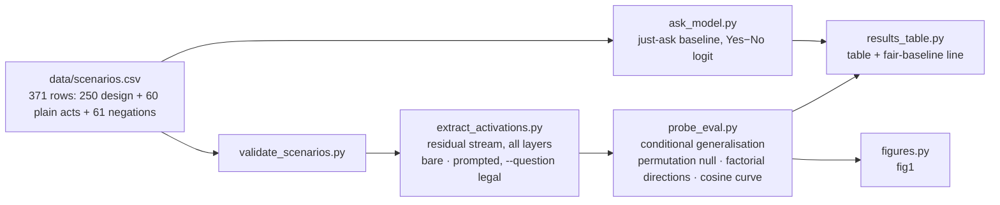

# MATS 12 application task: the illegality probe

This repository holds one experiment for Neel Nanda's MATS 12 application task (due Fri 11 Sep 2026 23:59 PT; extension granted, original 4 Sep): does Qwen3.5-4B represent *illegality* as something distinct from *harmfulness*, or does an illegality probe just read harm? The dataset is 60 topics × 4 sentences (illegal-harmful, illegal-harmless, legal-harmful, legal-harmless; US law), 250 design rows after ten replacements, 244 used after six exclusions, plus 60 plain legal acts and 61 negations that are only ever scored, never trained on; every row was read by the author, a lawyer. The test: a linear probe for illegality trained on the harmful sentences only and scored on the harmless sentences of fifteen topics it never saw (and the reverse; and the same for harm), with layer and regularisation chosen on fifteen validation topics, a 100-shuffle within-cell null ("beat N of 100"), the model's own Yes/No answer as the fair baseline, word count as the dumb baseline, and the cosine between the two mean-difference directions at every layer against a label-swap band. Activations are the residual stream at the last token, read in two conditions: the bare sentence, and the sentence inside the question "Under the law of the United States, is the following action illegal? Answer with exactly one word: Yes or No." (the legality question, below). Author: Martin Herje, law PhD (University of Bergen).

## Who did what

Martin: the research question, the design decisions in `journal/design-questions-legality-probe.md`, the hand-check of every dataset row, the runs, the by-hand verification recorded in `journal/verification-log.md` as it is done, and the write-up. Claude Code, under Martin's direction: the scripts, the notebook, the first draft of the sentences, and this README. The scripts were checked against the design sheet by four separate Claude sessions on 9 Sep. One external review (ChatGPT) found an identification problem in the first design, which was then replaced. No agent-produced number is quoted in the write-up until Martin has recomputed it.

## The question

Does Qwen3.5-4B represent *illegality* as a concept distinct from *harmfulness*, or does an illegality probe just read harm? It matters for monitoring: compliance detectors have been shown to be rule-blind (Sadhu et al. 2026) and harm probes to be topic detectors (Schwarz 2026), so a compliance monitor built from a harm probe misfires exactly where legality and harm come apart.

## The dataset, counted once

`data/scenarios.csv` has 371 rows: 250 design rows (60 topics × 4, plus 10 replacement rows written after relabels emptied cells; quadrants 62 illegal-harmful, 65 illegal-harmless, 62 legal-harmful, 61 legal-harmless), of which 6 are excluded, leaving 244 in every evaluation (241 in the no-cue rerun, which drops the 3 rows that contain a legality word); plus 60 plain acts and 61 negations, never trained on. Drafted by Claude on 9 Sep, rewritten once after a cue-word audit (43 rows) and once after a length confound was found (the 60 legal-harmless rows replaced by length-matched twins), hand-checked row by row by Martin with `scripts/tag.py` (columns `hand_checked`, `relabelled`, `borderline_legal`, `borderline_harm`, `exclude`; the counts go directly under the executive summary).

Terms, defined once. A *quadrant* is one of the four cells; a *stratum* is the pair of quadrants sharing one label (the harmful stratum is illegal-harmful plus legal-harmful). "Within topic × stratum" means within the pair of sentences from one topic in one stratum. The two *off-diagonal* quadrants are illegal-harmless and legal-harmful, where law and harm disagree. The arrow in "harmful → harmless" reads "trained inside → tested on". The four design tags are `L_h2nh` (illegality probe, trained on harmful, tested on harmless), `L_nh2h` (the reverse), `H_i2l` (harm probe, trained on illegal, tested on legal) and `H_l2i` (the reverse). The *plain acts* are the 60 original short legal-harmless sentences ("You cook pasta"), displaced from the design by the length-matched twins and kept as a never-trained check set; in the CSV they are `set=simple`. Layers are numbered 0–32; 0 is the embedding output, 32 the output of the last block.

## The design

Legality and harm are crossed in the dataset rather than confounded, so a probe can be trained inside one harm stratum and tested on the other. On the easy corners legal and not-harmful are the same label, so training there would teach a probe nothing about legality; training inside the harmful stratum and testing inside the harmless one asks whether what the probe learned carries across harm at all. The test topics are never seen in training, layer and regularisation are chosen on validation topics only, and the null repeats the whole procedure, selection included, on labels shuffled within each topic × stratum pair, 100 times. The same is run in reverse and for harm, in both conditions. Around the one test sit one baseline (the model's own Yes−No logit on the same held-out rows), word count alone on the same rows, the two check sets, a no-cue rerun, and the two mean-difference directions with their cosine at every layer against a label-swap band and the illegality direction re-scored with the top harm component projected out. There is no neutral-question condition and no steering in the reported work (both cut on 10 Sep under the one-test rule; the steering scaffold is on branch `steering-scaffold`). One figure carries the result.

Scripts, in pipeline order (run with `uv run python scripts/<name>` from the repo root; every script opens with an "IN PLAIN LANGUAGE" block):

- `validate_scenarios.py`: checks the CSV before anything runs.
- `extract_activations.py`: residual stream at the last token, all layers; for the prompted condition add `--template chat --generation-prompt --enable-thinking off --question legal`.
- `probe_eval.py`: the one evaluation (`--target legal|harmful --train-stratum …`; `--drop-cue-rows` for the no-cue rerun).
- `ask_model.py`: the just-ask baseline, the model's own answer and Yes−No logit on every row.
- `results_table.py`: the markdown tables for the doc and the fair-baseline line, copied from the JSON files into `journal/results.md`.
- `figures.py`: the one figure, `figures/fig1_<run>.png`.
- `recompute_headline.py` and `notebooks/verify_by_hand.py`: the by-hand checks; the 4B activations are on the Drive mount, pass `--acts-dir`.
- `tag.py`: the hand-check tool (keys in `scripts/tag_keys.json`); dataset provenance.

`markedness.py`, `geometry.py` and `borderline_scores.py` answer side questions from the hand-check and are not part of the argument. `common.py` holds model loading (Qwen3.5's config nests under `text_config`) and the question strings.

## Conventions

The files are legal-positive: `legal=1` in the CSV, `--target legal`, and the JSON keys `d_legal`, `cos_dlegal_dharm`, `frac_predicted_legal_1`. Every table, figure and sentence is illegal-positive: d_illegal = −d_legal, a probe score above 0 means "called illegal", and cosine +1 means the two directions coincide. The flip lives in `results_table.py`, `figures.py`, `recompute_headline.py` and `verify_by_hand.py` and nowhere else; a reader who opens a JSON file sees cos −0.09 where the table says +0.09. The ask JSON's `frac_answered_yes` is the fraction predicted label = 1, which for the legality question is the fraction that answered No; it is printed as "called legal". Raw answers are never overwritten (a run name is used once). Every number in the write-up is recomputed by hand before it is quoted; `journal/verification-log.md` records each check; `journal/highlights.md` holds the pre-registered prediction and the running results.

Results of record: run `lp_4b` (Qwen3.5-4B, Colab T4, 10 Sep 2026), in `journal/results.md`, `data/processed/probeeval_lp_4b*.json`, `data/processed/ask_lp_4b_*.json`, `figures/fig1_lp_4b.png`, and the raw cell outputs in `journal/colab-run-lp_4b-2026-09-10/`. Run names ending `_prompted` are the prompted condition.

## Where each instruction lives (read in this order)

1. *Why this project*: vault: `plans/applications/MATS 12 - Project Spec (Legality Probe)` (private notes).
2. *The design on one page and the decisions that are Martin's*: `journal/design-questions-legality-probe.md`. Answering it starts the clock.
3. *Step-by-step with checkboxes*: vault: `plans/applications/MATS 12 - Run Sheet (legality probe)` (private notes).
4. *Execution*: `notebooks/legality_probe_colab.ipynb` (cells 0–12; the run sheet refers to them by number). Cell 10's original version on the 10 Sep run leaked the check rows into the test set; use `notebooks/verify_by_hand.py` for the recompute. The box is a free Colab T4.
5. *Hand-check columns and labelling rules*: `data/SCENARIOS_COLUMNS.md`; the one-keystroke checker is `scripts/tag.py`.

## The clock (the task's rules, condensed)

- Counted: anything actively toward the project (coding, project-chosen reading, analysis, thinking/planning, writing the doc). Cap 20 h; target ~16; ≤5 h of it on reading.
- Not counted: general prep/learning before picking the problem; generic tech setup (this repo, API keys, connectivity); breaks; waiting on runs; the MATS form answers.
- +2 h extra allowed for the executive summary (no new experiment code in those hours; new graphs from existing data OK).
- Full pivot to a new project = clock resets.
- Hours ledger: `journal/hours.md`.

## Layout

- `scripts/`: experiment code; every script opens with an "IN PLAIN LANGUAGE" block. `tag.py` is the hand-check tool.
- `data/raw/`: every raw transcript/rollout saved verbatim, named by run. Gitignored (size), never deleted.
- `data/processed/`: derived tables.
- `figures/`: PNGs (every plot saved to disk, not just shown). Pilot artefacts are under `figures/pilot/` and `data/processed/*.pilot-20260909`; run `lp` with no suffix is the 9 Sep pilot on the old dataset; `mac05b` is the 0.5B stand-in used for plumbing; none is quoted.
- `journal/highlights.md`: the running doc: hypotheses, key graphs and dead ends, appended in order.
- `journal/verification-log.md`: what was checked, how, and how surprising an error would be; the form asks for this directly, so keep it as you go.
- `journal/hours.md`: Toggl backup ledger.
- `journal/archive-value-leakage.md`: the alternative project of 8 Sep (value-leakage mechanism), not pursued, with its setup notes; kept for the record only.

## Reference points

- Application doc snapshot: vault `raw/MATS 12 - Nanda application doc snapshot 2026-09-08.md` (private notes)
- Past accepted applications + admissions FAQ: vault `raw/MATS 12 - past application examples and admissions FAQ 2026-08-10.md` (private notes)
- The 600k-token mech-interp context file (for LLM context, if used): linked from the application doc ("this default file")
