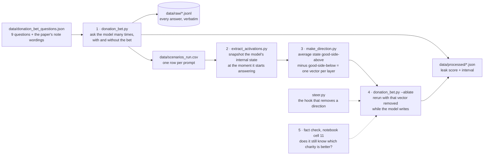

# MATS 12 application task — workspace

Working environment for the Neel Nanda MATS 12 application task (due **Fri 11 Sep 2026** (extension granted; original 4 Sep)). The research in this repo is Martin's own work; this scaffold (folders, env config, smoke test, journal templates) is generic infrastructure, which Nanda's rules place **outside** the 16–20 h clock — as is all general learning done before project work starts.

Vault companion note (strategy, form questions, project spec, calibration): `~/Documents/PhDAI/plans/applications/MATS 12 - Application Task Plan.md`

## The clock (Nanda's rules, condensed)

- Counted: anything actively toward the project — coding, project-chosen reading, analysis, thinking/planning, writing the doc. Cap 20 h; target ~16; ≤5 h of it on reading.
- Not counted: general prep/learning before picking the problem; generic tech setup (this repo, API keys, connectivity); breaks; waiting on runs; the MATS form answers.
- +2 h extra allowed for the executive summary (no new experiment code in those hours; new graphs from existing data OK).
- Full pivot to a new project = clock resets.
- Track with Toggl from the first project-directed minute; screenshot goes in the application doc.

## Read this first: how the pieces fit

The whole project is five steps, one script each. Each script has an "IN PLAIN LANGUAGE" block at the top saying what goes in, what comes out, and what to hand-check. The notebook `notebooks/mats12_colab.ipynb` runs them in order with an explanation before every cell.

In words: **measure the leak** (1), **look inside** (2, 3), **remove what you found and measure again** (4), **check you removed the motivation and not the knowledge** (5). The controls that make it an argument rather than a demo are all in step 4: a random direction (removing *anything* should not work), the topic direction (knowing a bet exists is not the same as knowing which side is good), and the equal-charity condition from step 1 (a bet with no reason to lean should show no leak).

Conventions: raw answers are never overwritten (a run name is used once); every number in the write-up is recomputed by hand from `data/raw/` before it is quoted; `journal/verification-log.md` records each check.

## Project (chosen 9 Sep): the legality probe — is illegality represented separately from harm?

Notebook: `notebooks/legality_probe_colab.ipynb` (narrated; settings in one cell). Design sheet: `journal/design-questions-legality-probe.md`. Spec in the vault: `plans/applications/MATS 12 - Project Spec (Legality Probe).md`. Dataset: `data/scenarios.csv` (240 candidates, 60 topics × 4 quadrants, US law, hand-check pending). Pipeline: `validate_scenarios.py` → `extract_activations.py` → `train_probe.py` (with `--eval-label` for the harm-probe-predicts-legality test, `--control`, `--bow`, `--contrast`) → `ask_model.py` (the just-ask baseline) → optional steering (notebook cell 11, via `steer.py`).

The value-leakage material below is kept as the documented alternative.

## Alternative (built 8 Sep): value-leakage mechanism

**Where does the value intervene?** Mechanism behind Betley et al. 2026, *Value Leakage* (arXiv 2607.14345), Donation Bet task, on Qwen3.5-9B. Primer (read first): vault `plans/applications/MATS 12 - Value Leakage Primer.md`. Design sheet (yours): `journal/design-questions-value-leakage.md`. Paper code (sparse clone, no data): `data/reference/value_leakage/`; the exact prompt templates and nine questions are in `data/donation_bet_questions.json`.

**Browser route (preferred, 9 Sep):** open `notebooks/mats12_colab.ipynb` in Google Colab ([direct link](https://colab.research.google.com/github/martinherje/mats12/blob/main/notebooks/mats12_colab.ipynb) — authorise Colab's GitHub access for the private repo, or upload the notebook by hand), pick a GPU runtime, run the cells top to bottom. Cell 2 mounts Drive so `data/`, `figures/` and `journal/` survive the VM; a fine-grained GitHub token in Colab Secrets (`GITHUB_TOKEN`) lets cell 2 clone the private repo and cell 11 push the journal back. A free T4 runs Qwen3.5-4B in fp16; L4/A100 in bf16.

**PC route (alternative):** (after `uv sync` and the smoke test): `.\scripts\gonogo.ps1` — runs the concrete, abstract and equal variants on Qwen3.5-4B with thinking off and on and prints the three bias tables.

Pipeline:
1. `scripts/donation_bet.py` — replication + interventions. `--backend api` runs the same Qwen3.5-9B through OpenRouter (needs `OPENROUTER_API_KEY` in `.env`) for the go/no-go from the Mac; `--backend local` runs on the pod and supports `--ablate`. Writes raw rollouts to `data/raw/`, bias + bootstrap CI to `data/processed/`, and `data/scenarios_<run>.csv` for step 2.
2. `scripts/extract_activations.py --scenarios data/scenarios_<run>.csv --template chat --generation-prompt --enable-thinking off --run <run>` — residual stream at the last prompt token, all layers.
3. `scripts/make_direction.py --run <run> --label good_side --filter "bet==1" --out direction_<run>_good_side` (+ `--label bet` for the topic control).
4. `scripts/donation_bet.py --backend local --reuse-thresholds <run> --ablate data/processed/direction_<run>_good_side.npz --layers <L> --mode ablate|random --run <run>_abl_L<L>` — the causal move and its controls.
5. `scripts/train_probe.py` — optional layer sweep / held-out AUROC if you go the per-sample route.

Self-tests on the Mac (0.5B stand-in): `scripts/steer.py` and `scripts/donation_bet.py --backend local --model Qwen/Qwen2.5-0.5B-Instruct ... --run plumb` both pass; numbers from the stand-in mean nothing.

## Environment (updated 8 Sep — GPU/activation path)

The legality probe (spec in the vault; sheet `journal/design-questions-legality-probe.md`) is now the **fallback**. Either project needs residual-stream activations from **Qwen/Qwen3.5-4B**, so the box is a rented 24 GB GPU — see `RUNPOD.md`. The API-only path below is kept for the "just ask the model" baseline.

Pipeline (all generic, all outside the clock): `scripts/gpu_smoke.py` → `scripts/validate_scenarios.py` → `scripts/extract_activations.py` → `scripts/train_probe.py` → `scripts/sync_from_pod.sh`. The Mac runs the same pipeline on a 0.5B model to check the plumbing; the numbers only mean anything on the pod. `data/scenarios_smoke.csv` is a plumbing test with arbitrary labels and is never project data. Python is pinned to 3.12 (`.python-version`) because torch does not yet ship for 3.14.

## One-time setup (Martin does these — accounts and payments are yours)

1. Create an OpenRouter account (openrouter.ai) → add a few dollars of credit → create an API key.
2. `cp .env.example .env` and paste the key. `.env` is gitignored — keys never enter git.
3. `uv sync` (creates `.venv` with openai/dotenv/pandas/matplotlib/tqdm).
4. `uv run python scripts/api_smoke.py` — verifies the pipe: one tiny call to `openai/gpt-oss-120b`, prints whether the **reasoning field** comes back visible. Reasoning visibility is load-bearing for any CoT-reading project; if a provider hides it, we pin a provider that doesn't.
5. (Only if the project ends up needing CoT partial-refill/resampling: Nebius account, same pattern.)

## Layout

- `scripts/` — experiment code (Martin's). `api_smoke.py` is the only pre-provided file, and it is deliberately trivial.
- `data/raw/` — every raw transcript/rollout saved verbatim, named by run. Gitignored (size), never deleted.
- `data/processed/` — derived tables.
- `figures/` — PNGs (every plot saved to disk, not just shown).
- `journal/highlights.md` — the running doc Nanda's process expects: hypotheses, key graphs, dead ends, in order.
- `journal/verification-log.md` — what was checked, how, and how surprising an error would be. **The form asks for exactly this** ("which parts you did and didn't check... how surprised you'd be to discover a major error in each part") — keep it as you go and the answer writes itself.
- `journal/hours.md` — Toggl backup ledger.

## Reference points

- Application doc snapshot: vault `raw/MATS 12 - Nanda application doc snapshot 2026-08-10.md`
- Past accepted applications + admissions FAQ: vault `raw/MATS 12 - past application examples and admissions FAQ 2026-08-10.md`
- Nanda's 600k-token mech-interp context file (for LLM context, if used): linked from the application doc ("this default file")
- Model notes: `openai/gpt-oss-120b` on OpenRouter — $0.03/$0.17 per M tokens, 131k context, CoT access; Qwen 3.5-27B as contrast model; OpenAI Model Spec at model-spec.openai.com
