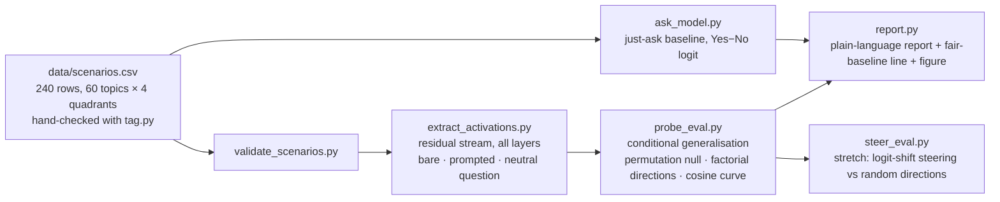

# MATS 12 application task — the legality probe

Working repo for the Neel Nanda MATS 12 application task (due **Fri 11 Sep 2026 23:59 PT**; extension granted, original 4 Sep). Author: Martin Herje, law PhD (University of Bergen).

**Who did what, stated plainly.** The research question, the design decisions recorded in `journal/design-questions-legality-probe.md`, the hand-check of every dataset row, the runs, the by-hand verification of the headline numbers (`journal/verification-log.md`) and the write-up are Martin's. The scripts, the notebook, the first draft of the 240 sentences and this scaffold were written by Claude (Claude Code) under Martin's direction, and were reviewed against the design sheet by four independent reviewer passes on 9 Sep; the design itself was corrected once after an external review (ChatGPT) caught an identification problem. Nothing produced by an agent is quoted in the write-up until Martin has recomputed it by hand.

## The question

Does Qwen3.5-4B represent *illegality* as a concept distinct from *harmfulness*, or is a legality probe just a harm probe wearing a hat? It matters for monitoring: compliance detectors have been shown to be rule-blind (Sadhu et al. 2026) and harm probes to be topic detectors (Schwarz 2026), so a compliance monitor built from a harm probe misfires exactly where legality and harm come apart.

## Where each instruction lives (read in this order)

1. *Why this project* — vault: `plans/applications/MATS 12 - Project Spec (Legality Probe)`.
2. *The design on one page and the decisions that are Martin's* — `journal/design-questions-legality-probe.md`. Answering it starts the clock.
3. *Step-by-step with checkboxes* — vault: `plans/applications/MATS 12 - Run Sheet (legality probe)`.
4. *Execution* — `notebooks/legality_probe_colab.ipynb` (cells numbered 1–12; the run sheet refers to them by number). The box is a free Colab T4; `RUNPOD.md` is the rented-GPU alternative.
5. *Hand-check columns and labelling rules* — `data/SCENARIOS_COLUMNS.md`; the one-keystroke checker is `scripts/tag.py` (keys in `scripts/tag_keys.json`).

## The design in three sentences

The dataset is 60 topics × 4 matched sentences (illegal-harmful, illegal-harmless, legal-harmful, legal-harmless; US law; second person), so legality and harm are crossed rather than confounded. A probe trained on the easy corners cannot tell legality from not-harm, because there they are the same label, so the legality probe is trained inside one harm stratum and tested on the other, on held-out topics, with layer and regularisation chosen on validation topics only and a permutation null that repeats the whole selection on labels shuffled within topic × stratum ("beat N of 100"). Factorial mean-difference directions, their cosine at every layer against a label-swap null band, the legality direction with harm components projected out, a just-ask baseline (the model's own Yes−No logit on the same held-out rows), a no-cue-word rerun and a neutral-question control turn the number into an argument; steering is the stretch goal.

**Scripts, in pipeline order:** `validate_scenarios.py` → `extract_activations.py` (`--template chat --generation-prompt --instruction …` for the prompted and neutral conditions) → `probe_eval.py` (the headline; `--target legal|harmful --train-stratum …`, `--drop-cue-rows`, `--drop-borderline`) → `ask_model.py` → `report.py` → `results_table.py` (the markdown tables for the doc, copied from the JSON files) → `figures.py` (the three figures) → `markedness.py` (is the marked concept illegality, legality, or both? plain acts as the neutral baseline) → `steer_eval.py`. `train_probe.py` remains as an exploratory layer sweep; it is not the headline evaluation. `common.py` holds model loading (Qwen3.5's config nests under `text_config`).

**Dataset:** `data/scenarios.csv`, 240 rows, drafted by Claude on 9 Sep, rewritten once after a cue-word audit, hand-checked row by row by Martin (columns `hand_checked`, `relabelled`, `borderline_legal`, `borderline_harm`, `exclude`; counts go directly under the executive summary).

**Conventions:** raw answers are never overwritten (a run name is used once); every number in the write-up is recomputed by hand before it is quoted; `journal/verification-log.md` records each check; `journal/highlights.md` holds the pre-registered prediction and the running results.

## The clock (Nanda's rules, condensed)

- Counted: anything actively toward the project — coding, project-chosen reading, analysis, thinking/planning, writing the doc. Cap 20 h; target ~16; ≤5 h of it on reading.
- Not counted: general prep/learning before picking the problem; generic tech setup (this repo, API keys, connectivity); breaks; waiting on runs; the MATS form answers.
- +2 h extra allowed for the executive summary (no new experiment code in those hours; new graphs from existing data OK).
- Full pivot to a new project = clock resets.
- Hours ledger: `journal/hours.md`.

---

## Archived alternative (8 Sep, not pursued): value-leakage mechanism

**Where does the value intervene?** Mechanism behind Betley et al. 2026, *Value Leakage* (arXiv 2607.14345), Donation Bet task, on Qwen3.5-9B. Primer (read first): vault `plans/applications/MATS 12 - Value Leakage Primer.md`. Design sheet (yours): `journal/design-questions-value-leakage.md`. Paper code (sparse clone, no data): `data/reference/value_leakage/`; the exact prompt templates and nine questions are in `data/donation_bet_questions.json`.

**Browser route (preferred, 9 Sep):** open `notebooks/mats12_colab.ipynb` in Google Colab ([direct link](https://colab.research.google.com/github/martinherje/mats12/blob/main/notebooks/mats12_colab.ipynb) — authorise Colab's GitHub access for the private repo, or upload the notebook by hand), pick a GPU runtime, run the cells top to bottom. Cell 2 mounts Drive so `data/`, `figures/` and `journal/` survive the VM; a fine-grained GitHub token in Colab Secrets (`GITHUB_TOKEN`) lets cell 2 clone the private repo and cell 11 push the journal back. A free T4 runs Qwen3.5-4B in fp16; L4/A100 in bf16.

**PC route (alternative):** (after `uv sync` and the smoke test): `.\scripts\gonogo.ps1` — runs the concrete, abstract and equal variants on Qwen3.5-4B with thinking off and on and prints the three bias tables.

Pipeline:
1. `scripts/donation_bet.py` — replication + interventions. `--backend api` runs the same Qwen3.5-9B through OpenRouter (needs `OPENROUTER_API_KEY` in `.env`) for the go/no-go from the Mac; `--backend local` runs on the pod and supports `--ablate`. Writes raw rollouts to `data/raw/`, bias + bootstrap CI to `data/processed/`, and `data/scenarios_<run>.csv` for step 2.
2. `scripts/extract_activations.py --scenarios data/scenarios_<run>.csv --template chat --generation-prompt --enable-thinking off --run <run>` — residual stream at the last prompt token, all layers.
3. `scripts/make_direction.py --run <run> --label good_side --filter "bet==1" --out direction_<run>_good_side` (+ `--label bet` for the topic control).
4. `scripts/donation_bet.py --backend local --reuse-thresholds <run> --ablate data/processed/direction_<run>_good_side.npz --layers <L> --mode ablate|random --run <run>_abl_L<L>` — the causal move and its controls.
5. `scripts/train_probe.py` — optional layer sweep / held-out AUROC if you go the per-sample route.

Self-tests on the Mac (0.5B stand-in): `scripts/steer.py` and `scripts/donation_bet.py --backend local --model Qwen/Qwen2.5-0.5B-Instruct ... --run plumb` both pass; numbers from the stand-in mean nothing.

---

## One-time setup (only needed for the OpenRouter path of the archived alternative)

1. Create an OpenRouter account (openrouter.ai) → add a few dollars of credit → create an API key.
2. `cp .env.example .env` and paste the key. `.env` is gitignored — keys never enter git.
3. `uv sync` (creates `.venv` with openai/dotenv/pandas/matplotlib/tqdm).
4. `uv run python scripts/api_smoke.py` — verifies the pipe: one tiny call to `openai/gpt-oss-120b`, prints whether the **reasoning field** comes back visible. Reasoning visibility is load-bearing for any CoT-reading project; if a provider hides it, we pin a provider that doesn't.
5. (Only if the project ends up needing CoT partial-refill/resampling: Nebius account, same pattern.)

## Layout

- `scripts/` — experiment code; every script opens with an "IN PLAIN LANGUAGE" block. `tag.py` is the hand-check tool.
- `data/raw/` — every raw transcript/rollout saved verbatim, named by run. Gitignored (size), never deleted.
- `data/processed/` — derived tables.
- `figures/` — PNGs (every plot saved to disk, not just shown). The seven `pilot_*`-era PNGs are from the pre-rewrite dataset and must not appear in the write-up.
- `journal/highlights.md` — the running doc Nanda's process expects: hypotheses, key graphs, dead ends, in order.
- `journal/verification-log.md` — what was checked, how, and how surprising an error would be. **The form asks for exactly this** ("which parts you did and didn't check... how surprised you'd be to discover a major error in each part") — keep it as you go and the answer writes itself.
- `journal/hours.md` — Toggl backup ledger.

## Reference points

- Application doc snapshot: vault `raw/MATS 12 - Nanda application doc snapshot 2026-09-08.md`
- Past accepted applications + admissions FAQ: vault `raw/MATS 12 - past application examples and admissions FAQ 2026-08-10.md`
- Nanda's 600k-token mech-interp context file (for LLM context, if used): linked from the application doc ("this default file")
- Model notes: `openai/gpt-oss-120b` on OpenRouter — $0.03/$0.17 per M tokens, 131k context, CoT access; Qwen 3.5-27B as contrast model; OpenAI Model Spec at model-spec.openai.com
